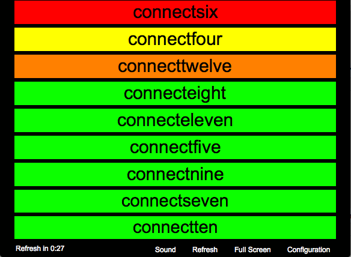

# Big Dashboard for Monitoring Continuous Integration Tools
Back in 2009, it was inspired by other tools like BigVisibleCruise. I made an AIR application, so you can use it on Windows, Mac OS X and Linux.

Basically, it fetches the same xml feed used by the [cctray](http://www.cruisecontrolnet.org/projects/ccnet/wiki/Visualizers) tool. So you will be able to monitor the `CruiseControl` family and  the `Hudson` family. See each tool documentation. If your tool does not provide natively `cctray` feed, you may try third party plugins.

The back story is that it was my first AIR application and also I wanted to try the `mate` framework. So it may need some refactoring and more feature! I don't plan to maintain this project or maybe just for myself someday ;)

## Install
You need to install the [Adobe AIR Runtime](http://get.adobe.com/air/).
On Linux, the lastest version is [2.6](http://helpx.adobe.com/air/kb/archived-air-sdk-version.html)

Now, you can launch the air file to install. You may need administrator rights.

Once installed, you must specify the URL of the xml (same as `cctray`). For instance, `http://hudson.jboss.org/hudson/view/JBoss%20Portal/cc.xml`

You can download and try a version [here](https://www.box.com/s/30v4caj5cp7v3oogkoka)

## Build
Although it runs on Linux, building may not work. Well I don't know :)
Anyway, You will need

1. ant 1.7+
2. [Flex SDK 4.5.1](http://sourceforge.net/adobe/flexsdk/wiki/Download%20Flex%204.5/)
3. Get a code-signing certificate. I don't have one so I use a [self-signed certificate](http://help.adobe.com/en_US/air/build/WS5b3ccc516d4fbf351e63e3d118666ade46-7f74.html)
4. Define some properties in a file `$HOME/.ant-global.properties`

        flex_sdk_4.5=${user.home}/work/tools/sdk/flex_sdk_4.5
        air.keystore=${user.home}/work/air-cert.p12
        air.keystore.password=mysecret

Now you can launch `ant air` to build the application.

